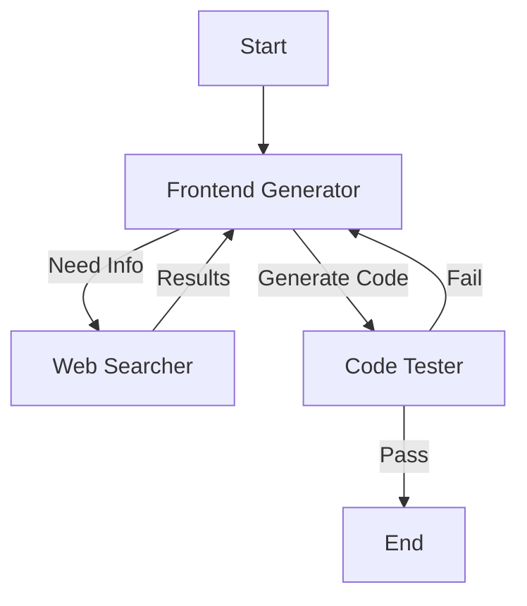

# CodeNova AI

> **Advanced Agentic Frontend Architect powered by LangGraph & Ollama**

CodeNova AI is a state-of-the-art autonomous coding agent designed to architect, generate, and validate frontend solutions. Built on **LangGraph**, it employs a specialist node architecture to self-correct, research, and test code in real-time.

## 🚀 Features

- **Multi-Agent Architecture**: distinct specialist nodes for *Generation*, *Research*, and *Quality Assurance*.
- **Self-Healing Workflow**: Automatically detects errors during testing and iterates to fix them without user intervention.
- **Active Web Research**: Uses a dedicated searcher node to find the latest documentation and coding patterns (2026+ standards).
- **Daytona Integration**: Sandboxed environment testing to ensure code runs correctly before final output.
- **Local LLM Support**: Optimized for **Ollama** (e.g., `glm-4.6:cloud`) for privacy and speed.

## 🏗 Architecture

The system operates on a cyclic graph architecture:



- **Frontend Generator**: The "Architect". Orchestrates the workflow, decides when to search, and writes code.
- **Web Searcher**: The "Researcher". Fetches external documentation to prevent hallucinations.
- **Code Tester**: The "QA Engineer". Runs code in a Daytona sandbox and provides feedback.

## 🛠 Prerequisites

- **Python 3.10+**
- **Ollama**: Running locally with `glm-4.6:cloud` (or configurable model).
- **Daytona**: Installed and configured for sandboxed testing.

## 📦 Installation

1. **Clone the repository**
   ```bash
   git clone https://github.com/Malikabriq/CodeNova-Ai.git
   cd CodeNova-Ai
   ```

2. **Create a Virtual Environment**
   ```bash
   python -m venv venv
   # Windows
   .\venv\Scripts\activate
   # macOS/Linux
   source venv/bin/activate
   ```

3. **Install Dependencies**
   ```bash
   pip install -r requirements.txt
   ```

4. **Environment Configuration**
   Create a `.env` file in the root directory:
   ```ini
   # LLM Configuration
   OLLAMA_MODEL=glm-4.6:cloud
   
   # Search API (if applicable)
   TAVILY_API_KEY=your_key_here
   
   # Daytona Configuration
   DAYTONA_TARGET=local
   ```

## 🏃‍♂️ Usage

To start the agent and give it a task:

```bash
python test_agent.py
```

Modify `test_agent.py` to change the initial prompt or task description.

## 📂 Project Structure

```
CodeNova AI/
├── agent/                  # Core Agent Logic
│   ├── graph/              # LangGraph definitions
│   ├── nodes/              # Specialist Nodes (Generator, Searcher, Tester)
│   ├── tools/              # Tool implementations (Daytona, File I/O)
│   └── memory/             # Checkpointing and State Management
├── components/             # Generated output components
├── test/                   # Test scripts
├── .gitignore              # Git configuration
├── requirements.txt        # Python dependencies
└── test_agent.py           # Entry point script
```

## 🤝 Contributing

Contributions are welcome! Please open an issue or submit a pull request for any improvements.

## 📄 License

[MIT License](LICENSE)
